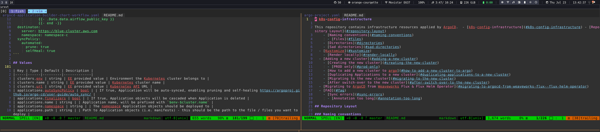

# crystal_barista

Some variations from the sample which is kindly provided by the Barista maintainer:

1) Only using mdi icons, I didn't want to have to mix and match all the icons, it seemed unnecessary
2) Removed the Google (EvilCorp) integration
3) Added kubeconfig integration
4) Updated colour scheme to match my i3, tmux and nvim colour schemes; all based on the dracula theme - https://github.com/dracula/vim

